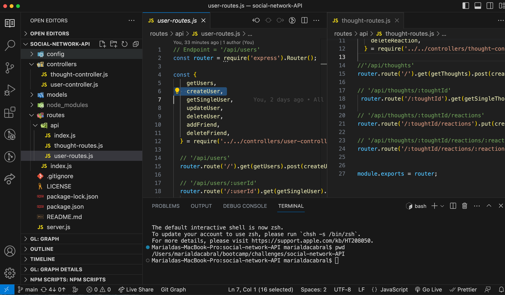
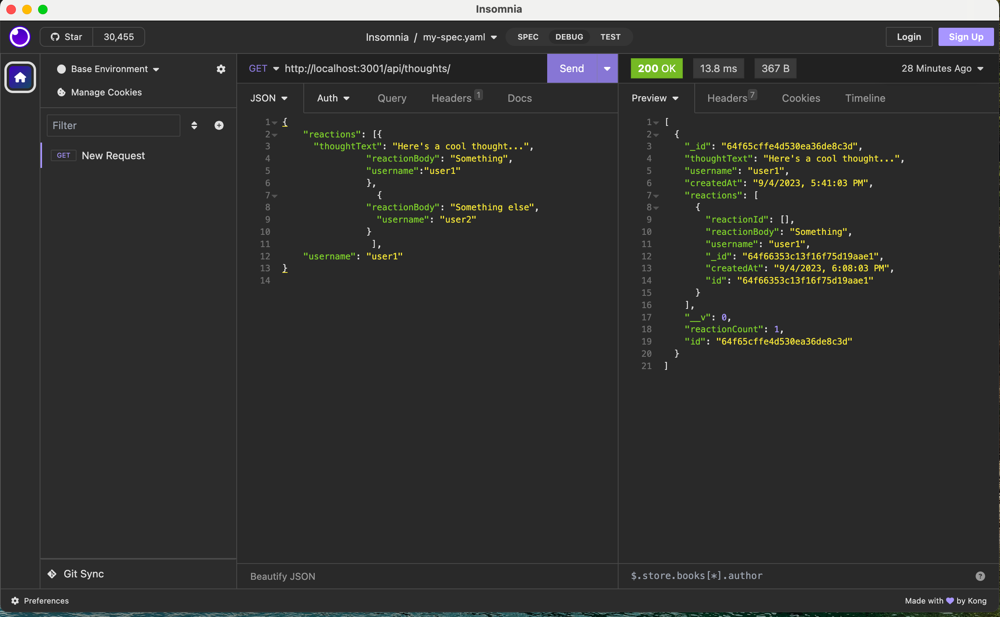

# Social Network API

## Table of Contents
  - [Description](#description)
  - [Screenshot](#screenshot)
  - [Installation](#installation)
  - [Usage](#usage)
  - [Videos](#videos)
  - [Contact](#contact)

## Description
This is an API for a social network web application where users can share their thoughts, react to friends’ thoughts, and create a friend list. This API uses Express.js for routing, a MongoDB database, and the Mongoose ODM. 

## Screenshot
This appliation can run form Visual Studio Code by using npm start.    
     

## Installation 
1 - npm i (to initialize)  
2 - npm start (for the app to start running on the server)  

## Usage
1 - npm start in the terminal  
2 - Go to Insomnia to test all routes below:  
  - `/api/users`
  - `/api/users/:userId`
  - `/api/users/:userId/friends/:friendId`
  - `/api/thoughts`
  - `/api/thoughts/:toughtId`
  - `/api/thoughts/:toughtId/reactions`
  - `/api/thoughts/:toughtId/reactions/:reactionId`

     

## Videos
First video showing how to initialzie the applicantion and the user routes:  
https://drive.google.com/file/d/1xr4vb0hgaREAf_R-vAYWRJeHD6ESLWVR/view
 
Second video showing the thought routes:  
https://drive.google.com/file/d/1h1WLzzL2NXFn66qbwEGCli3ySqG9pINB/view

## Contact
You can contact me via email: marialda@bellsouth.net
